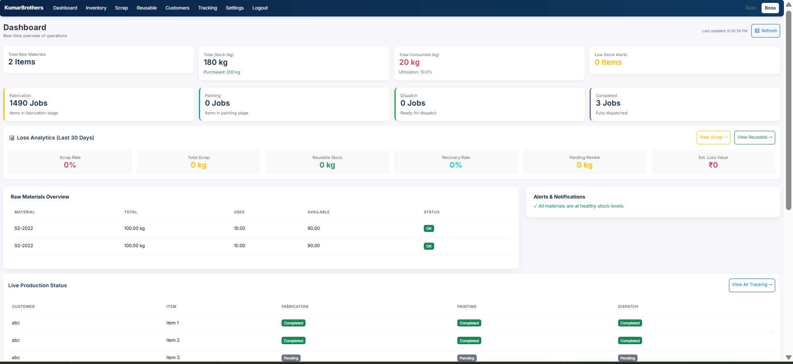
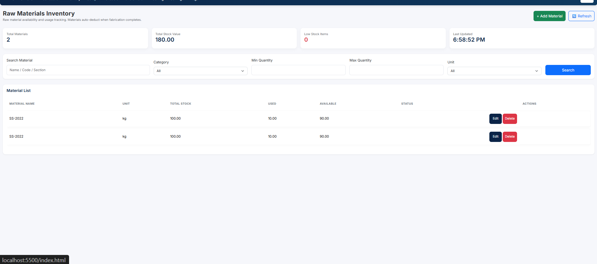
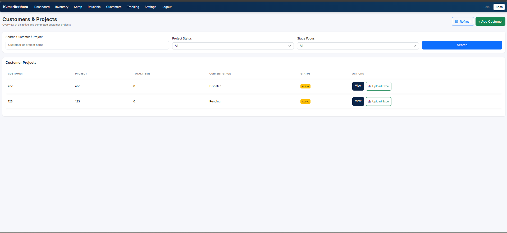
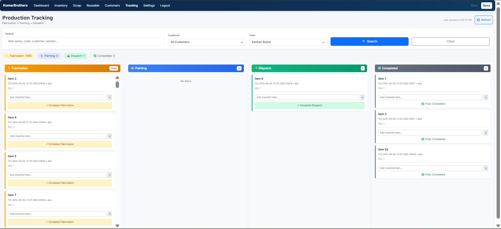

# KumarBrothers Steel ERP

[](https://github.com/mangod12/industryERP/actions/workflows/ci.yml)
[](https://github.com/mangod12/industryERP/actions/workflows/deploy.yml)

A comprehensive steel fabrication tracking and inventory management system with automatic material deduction, Excel import, and real-time dashboard.

**Live Azure deployment:** https://industryerp-06161244878.azurewebsites.net

**Deployment target:** Microsoft Azure App Service for Containers, backed by Azure Container Registry and Azure Database for PostgreSQL.

## 📸 System Screenshots

### Dashboard
<p align="center">
  
</p>

### Raw Materials Inventory
<p align="center">
  
</p>

### Customers & Excel Upload
<p align="center">
  
</p>

### Production Tracking Board
<p align="center">
  
</p>

---
---

## 📋 System Workflow (How It Works)

### Overview Diagram
```
┌─────────────────────────────────────────────────────────────────────────────┐
│                        KUMARBROTHERS STEEL ERP WORKFLOW                      │
└─────────────────────────────────────────────────────────────────────────────┘

    STEP 1                    STEP 2                    STEP 3
┌─────────────┐          ┌─────────────┐          ┌─────────────┐
│  Add Raw    │          │ Add Customer│          │Upload Excel │
│  Materials  │    →     │  /Project   │    →     │  Tracking   │
│  (Profiles) │          │             │          │    File     │
└─────────────┘          └─────────────┘          └─────────────┘
      │                                                  │
      │                                                  ▼
      │                                    ┌──────────────────────────┐
      │                                    │ System Auto-Links        │
      │                                    │ PROFILE → Raw Material   │
      │                                    │ (e.g., UB203X133X25)     │
      └───────────────────────────────────►└──────────────────────────┘
                                                         │
                                                         ▼
                         TRACKING STAGES (Sequential - Cannot Skip)
    ┌─────────────────┬─────────────────┬─────────────────┐
    │  FABRICATION    │    PAINTING     │    DISPATCH     │
    │    (Stage 1)    │    (Stage 2)    │    (Stage 3)    │
    │                 │                 │                 │
    │  ✓ Complete     │  ✓ Complete     │  ✓ Complete     │
    │      ↓          │      ↓          │      ↓          │
    │  AUTO-DEDUCT    │  Move to next   │    FINISHED!    │
    │  from inventory │     stage       │                 │
    └─────────────────┴─────────────────┴─────────────────┘
                                                         │
                                                         ▼
                                          ┌──────────────────────────┐
                                          │  Dashboard Updates       │
                                          │  - Stock reduced         │
                                          │  - Progress shown        │
                                          │  - All users see changes │
                                          └──────────────────────────┘
```

---

## 🔄 Step-by-Step Guide

### STEP 1: Add Raw Materials (Admin)
**Page: Raw Materials** → `/raw_material.html`

Before tracking can auto-deduct materials, you must add your steel profiles:

| Field | Example Value | Description |
|-------|---------------|-------------|
| Name | UB203X133X25 | Profile name (must match Excel PROFILE column) |
| Total | 5000 | Total quantity in kg |
| Used | 0 | Already used (starts at 0) |
| Unit | kg | Unit of measurement |

**Example Raw Materials to Add:**
```
UB203X133X25    - Universal Beam 203x133x25
UB254X146X31    - Universal Beam 254x146x31
ISMC250         - Indian Standard Medium Channel 250
```

> ⚠️ **Important:** The material NAME must match the PROFILE column in your tracking Excel/CSV file for auto-deduction to work.

---

### STEP 2: Add Customer/Project (Admin)
**Page: Customers** → `/customers.html`

1. Click **"+ Add Customer"**
2. Enter customer name and project details
3. Save the customer

Each customer can have multiple tracking Excel files uploaded.

---

### STEP 3: Upload Tracking Excel (Admin)
**Page: Customers** → Click **"Upload Excel"** button on any customer

#### Supported File Formats:
- ✅ Excel (.xlsx)
- ✅ Macro/template Excel (.xlsm, .xltx, .xltm)
- ✅ CSV (.csv)

#### Supported Column Names (Flexible):
The system auto-detects these columns:

| Excel Column | Maps To | Example |
|--------------|---------|---------|
| Drawing no | Item Code | TCI-SFD-49-02-11-07-000-01817 |
| ASSEMBLY | Assembly | B1, B2, C1 |
| NAME | Item Name | BEAM, COLUMN |
| **PROFILE** | Section | **UB203X133X25** (links to Raw Material) |
| QTY. | Quantity | 1, 2, 5 |
| WT-(kg) | Weight | 45.6, 123.4 |
| AR(m²) | Area | 1.23 |
| PAINT | Paint Status | - |
| LOT 1 | Lot Number | Lot tracking |

#### What Happens on Upload:
1. **Preview** shows which profiles match inventory (✅) vs unmatched (⚠️)
2. **Auto-Link**: System links PROFILE column to Raw Materials
3. **Import**: Creates tracking items in Fabrication stage
4. **Notification**: Warns if any profiles need to be added to Raw Materials

---

### STEP 4: Track Progress Through Stages
**Page: Tracking** → `/tracking_v2.html`

All items follow this sequence (cannot skip stages):

```
FABRICATION → PAINTING → DISPATCH → COMPLETED
```

#### For Each Item:
1. **Start Stage** → Status becomes "In Progress"
2. **Complete Stage** → Status becomes "Completed", moves to next stage

#### Special: Fabrication Completion
When Fabrication is marked **Complete**:
- ✅ System automatically deducts materials from inventory
- ✅ Deduction = Weight (kg) × Quantity from Excel
- ✅ Only happens ONCE per item (tracked by system)
- ✅ Dashboard immediately shows updated stock

---

### STEP 5: Monitor on Dashboard
**Page: Dashboard** → `/index.html`

Real-time display (auto-refreshes every 10 seconds):

| Metric | Description |
|--------|-------------|
| **Total Stock (kg)** | Current available raw materials |
| **Total Consumed (kg)** | Materials deducted by completed fabrication |
| **Utilization %** | Consumed / Purchased ratio |
| **Low Stock Alerts** | Items below 15% remaining |
| **Stage Counts** | Jobs in Fabrication/Painting/Dispatch |

---

## 📊 Example Workflow

### Scenario: New Project "TCIL Building Structure"

**1. Admin adds Raw Materials:**
```
UB203X133X25  - 5000 kg
ISMC250       - 3000 kg
```

**2. Admin adds Customer:** "TCIL Corporation"

**3. Admin uploads tracking CSV with 100 items:**
```csv
Drawing no,NAME,PROFILE,QTY.,WT-(kg)
DWG-001,BEAM,UB203X133X25,1,45.6
DWG-002,BEAM,UB203X133X25,2,91.2
DWG-003,CHANNEL,ISMC250,1,38.5
...
```

**4. System shows preview:**
- ✅ UB203X133X25 → Matched to "UB203X133X25" (5000 kg available)
- ✅ ISMC250 → Matched to "ISMC250" (3000 kg available)

**5. Import creates 100 tracking items in Fabrication stage**

**6. Worker completes fabrication for DWG-001:**
- Click "Complete" on Fabrication
- System deducts 45.6 kg from UB203X133X25
- Item moves to Painting stage
- Dashboard shows: UB203X133X25 = 4954.4 kg remaining

**7. Dashboard shows:**
- Fabrication: 99 jobs remaining
- Painting: 1 job
- Stock: 4954.4 kg (UB203X133X25)

---

## 🎯 Key Features

| Feature | Description |
|---------|-------------|
| **Flexible Excel Import** | Supports 40+ column name variations |
| **Auto Material Linking** | PROFILE column auto-matches to inventory |
| **Auto Deduction** | Materials deduct when Fabrication completes |
| **Stage Enforcement** | Cannot skip stages (Fab → Paint → Dispatch) |
| **Real-time Dashboard** | Updates every 10 seconds for all users |
| **Low Stock Alerts** | Notifications when materials run low |
| **Edit & Checklist** | Each item has edit and checklist features |
| **Search & Filter** | Find items by name, code, customer, stage |

---

## 🚀 Quick Start

### Prerequisites
- Python 3.10+
- pip (Python package manager)

### Step 1: Setup Environment

```powershell
cd D:\industryERP

# Create and activate virtual environment (optional but recommended)
python -m venv .venv
.venv\Scripts\Activate.ps1

# Install dependencies
pip install -r requirements.txt
```

### Step 2: Start Backend Server

```powershell
python -m uvicorn backend_core.app.main:app --reload --host 127.0.0.1 --port 8000
```

Backend and frontend will be available from the same local server: **http://127.0.0.1:8000**

### Step 3: Access the Application

Open your browser and navigate to: **http://127.0.0.1:8000/login.html**

---

## 🔐 Test Credentials

| Username | Password | Role | Permissions |
|----------|----------|------|-------------|
| `admin` | `Boss1234!` | Boss | Full access to all seeded local demo features |

### Creating Additional Test Users

After logging in as admin, you can create users with different roles:

| Role | Description |
|------|-------------|
| **Boss** | Full system access |
| **Software Supervisor** | Inventory, GRN, Dispatch management |
| **Store Keeper** | Stock operations, GRN creation |
| **QA Inspector** | Quality inspection and approval |
| **Dispatch Operator** | Dispatch operations only |
| **User** | View-only access |

---

## 📱 Available Pages

| Page | URL | Description |
|------|-----|-------------|
| Login | `/login.html` | User authentication |
| Dashboard | `/index.html` | Overview and stats |
| Raw Materials | `/raw_material.html` | Add/manage steel profiles |
| Customers | `/customers.html` | Customer management + Excel upload |
| Tracking | `/tracking_v2.html` | Stage tracking (Fab/Paint/Dispatch) |
| GRN | `/grn.html` | Goods Receipt Notes |
| Dispatch | `/dispatch.html` | Outward dispatch management |
| Settings | `/settings.html` | System settings |

---

## 🔧 API Documentation

Once the backend is running, access the interactive API docs:

- **Swagger UI**: http://127.0.0.1:8000/docs
- **ReDoc**: http://127.0.0.1:8000/redoc

### Key API Endpoints

| Endpoint | Description |
|----------|-------------|
| `POST /auth/login` | User authentication |
| `GET /inventory/` | List all raw materials |
| `GET /inventory/dashboard-data` | Dashboard statistics |
| `POST /excel/preview-import/{customer_id}` | Preview Excel with material matching |
| `POST /excel/import-tracking/{customer_id}` | Import tracking items |
| `POST /tracking/complete-stage` | Complete a stage (triggers auto-deduction) |
| `GET /tracking/all-items` | List all tracking items |

---

## 🏗️ Project Structure

```
industryERP/
├── backend_core/           # FastAPI Backend
│   ├── app/
│   │   ├── main.py         # App entry point
│   │   ├── models.py       # Database models
│   │   ├── excel.py        # Excel/CSV import with auto-linking
│   │   ├── tracking.py     # Stage tracking with auto-deduction
│   │   ├── inventory.py    # Raw materials & dashboard stats
│   │   ├── security.py     # Authentication & RBAC
│   │   ├── deps.py         # Dependencies
│   │   └── routers/        # Additional API routers
│   └── data/
│       └── kumar_core.db   # SQLite database
│
├── kumar_frontend/         # Frontend (HTML/JS/CSS)
│   ├── index.html          # Dashboard with grand totals
│   ├── login.html          # Login page
│   ├── raw_material.html   # Raw materials management
│   ├── customers.html      # Customers + Excel upload
│   ├── tracking_v2.html    # Stage tracking
│   ├── grn.html            # Goods Receipt Notes
│   ├── dispatch.html       # Dispatch management
│   ├── js/
│   │   ├── config.js       # API config
│   │   └── main.js         # Main application JS
│   └── css/
│       └── main.css        # Styles
│
├── scripts/
│   └── create_admin.py     # Admin user creation script
│
└── requirements.txt        # Python dependencies
```

---

## ❓ Frequently Asked Questions

### Q: Why aren't materials being deducted automatically?
**A:** Make sure:
1. The PROFILE column in your Excel matches the material NAME in Raw Materials
2. The item has WT-(kg) value in the Excel
3. You clicked "Complete" on Fabrication stage (not just "Start")

### Q: Can I upload different Excel formats?
**A:** Yes! The system supports 40+ column name variations. It auto-detects columns like "Drawing no", "PROFILE", "QTY.", "WT-(kg)", etc. Column order doesn't matter.

### Q: What happens if a profile is not in Raw Materials?
**A:** The item will still be imported, but no auto-deduction will happen. You'll see a warning to add the missing profile.

### Q: Can I skip the Painting stage?
**A:** No, stages must be completed in order: Fabrication → Painting → Dispatch.

### Q: How do I see all tracking items for a customer?
**A:** Go to Tracking page and filter by customer name.

---

## ⚙️ Environment Variables (Production)

For production deployment, set these environment variables:

```powershell
$env:KUMAR_SECRET_KEY = "your-secure-64-char-secret-key"
$env:ENVIRONMENT = "production"
$env:DATABASE_URL = "postgresql://..."
$env:CORS_ORIGINS = "https://industryerp-06161244878.azurewebsites.net"
```

## ☁️ Microsoft Azure CI/CD

Production deployment is handled by GitHub Actions workflow
`.github/workflows/deploy.yml`.

The deploy workflow runs manually through `workflow_dispatch` and automatically
after the `KBSteel CI` workflow succeeds on `main`.

Required GitHub repository variables:

| Variable | Purpose |
|----------|---------|
| `AZURE_WEBAPP_NAME` | Azure App Service name |
| `AZURE_RESOURCE_GROUP` | Production resource group |
| `AZURE_CONTAINER_REGISTRY` | ACR login server |
| `AZURE_IMAGE_NAME` | Container image repository name |
| `AZURE_LIVE_URL` | Public Azure URL used for health verification |

Required GitHub repository secrets:

| Secret | Purpose |
|--------|---------|
| `AZURE_CLIENT_ID` | GitHub OIDC Azure application client ID |
| `AZURE_TENANT_ID` | Azure tenant ID |
| `AZURE_SUBSCRIPTION_ID` | Azure subscription ID |

Azure runtime settings are configured on the App Service. Secret runtime values
such as `DATABASE_URL`, `KUMAR_SECRET_KEY`, and admin credentials must remain in
Azure App Service configuration, not in the repository.

---

## 🐛 Troubleshooting

### Port already in use
```powershell
# Find and kill process on port 8000
netstat -ano | findstr :8000
taskkill /PID <PID> /F
```

### Database reset
```powershell
# Delete database and restart server (will recreate tables)
Remove-Item backend_core/data/kumar_core.db
# Restart backend server
# Run create_admin.py to create admin user again
```

### Create admin user manually
```powershell
cd D:\industryERP
python scripts/create_admin.py
```

---

## 📞 Support

For issues or questions, contact the development team.
