# KumarBrothers Steel ERP Manual

Last verified: 2026-06-15

This manual explains the local demo system captured by Playwright. The screenshots were generated from the seeded demo database using:

```powershell
$env:E2E_BASE_URL = "http://127.0.0.1:8000"
$env:E2E_USERNAME = "admin"
$env:E2E_PASSWORD = "Boss1234!" # pragma: allowlist secret
cmd /c npm run test:e2e
```

## Start The Demo

1. Install dependencies:

```powershell
.\.venv\Scripts\python.exe -m pip install -r requirements.txt -r requirements-dev.txt
cmd /c npm install
cmd /c npx playwright install chromium
```

2. Seed demo data:

```powershell
$env:KUMAR_SECRET_KEY = "dev-secret-key-minimum-32-characters" # pragma: allowlist secret
.\.venv\Scripts\python.exe scripts\seed_demo.py
```

3. Start the app:

```powershell
$env:KUMAR_SECRET_KEY = "dev-secret-key-minimum-32-characters" # pragma: allowlist secret
$env:ENVIRONMENT = "development"
.\.venv\Scripts\python.exe -m uvicorn backend_core.app.main:app --host 127.0.0.1 --port 8000
```

4. Open `http://127.0.0.1:8000/login.html`.

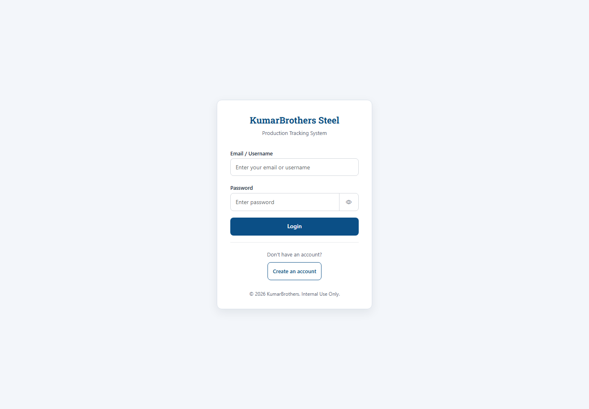

Demo credentials:

- Username: `admin`
- Password: `Boss1234!` <!-- pragma: allowlist secret -->

## Dashboard

The dashboard is the operations cockpit. It summarizes raw material stock, consumed stock, low-stock alerts, production counts by stage, scrap rate, reusable stock, and recent activity.

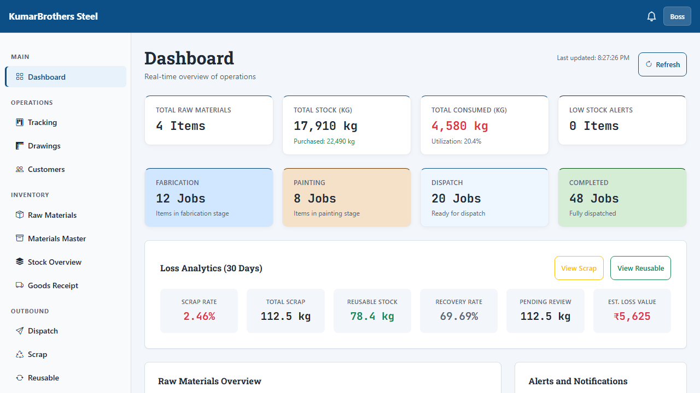

Use the dashboard to answer:

- How much material is available?
- Which production stages are loaded?
- Is scrap or reusable material increasing?
- Are there active alerts?

## Raw Materials

Raw Materials is the simple legacy inventory view. It stores material name, unit, total stock, used quantity, available quantity, and status. This view is useful for quick shop-floor stock updates.

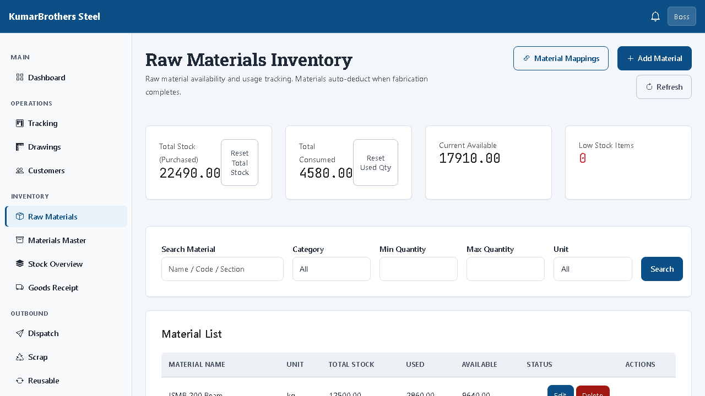

Primary actions:

- Add Material: create a simple inventory row.
- Edit/Delete: maintain legacy material records.
- Material Mappings: map Excel/tracking material names to inventory records for auto-deduction.
- Reset Total Stock and Reset Used Qty: Boss/Supervisor-only actions with typed confirmation before any reset request is sent.

## Materials Master

Materials Master is the V2 catalog. It defines formal steel material records such as code, type, grade, specification, dimensions, reorder levels, HSN code, and active status.

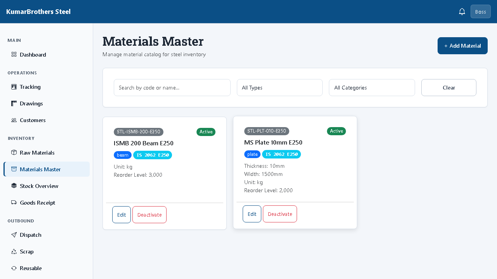

Use this when you need controlled master data for GRN, stock lots, dispatch, and reports.

## Stock Overview

Stock Overview shows V2 stock lots. A stock lot represents a physical batch with heat number, batch number, vendor, location, QA status, received date, current weight, and traceability.

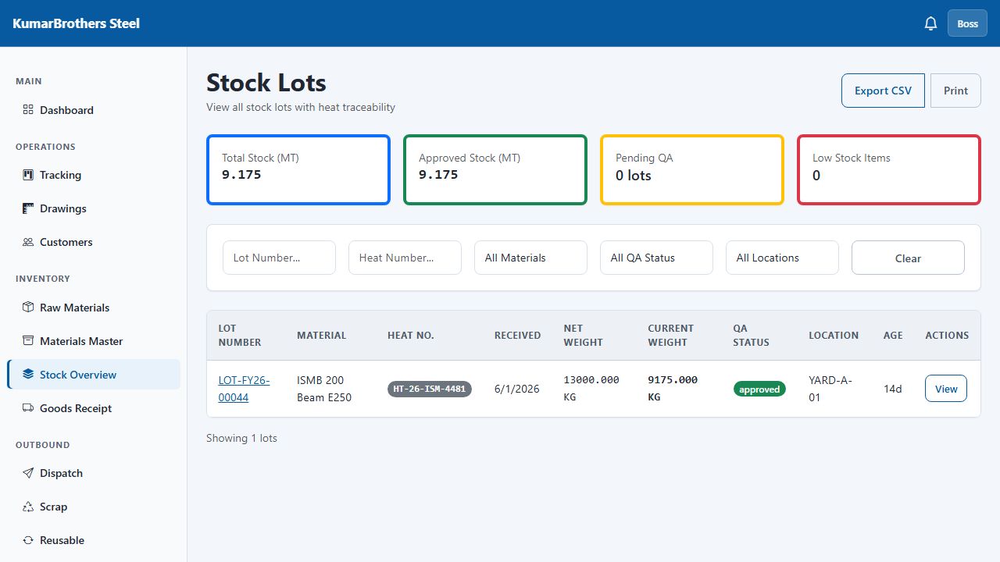

This is the source of truth for audited steel inventory. Stock should move through stock movements, not direct edits.
CSV export downloads the visible stock-lot rows. The lot detail modal loads movement history from the audit endpoint. Hold/Release controls are disabled with a tooltip until dedicated lot-status endpoints exist; use GRN QA inspection for current QA status changes.

## Goods Receipt

Goods Receipt records inward material flow. A GRN starts with vendor and vehicle details, gets line items and weighbridge data, then moves through QA and approval.

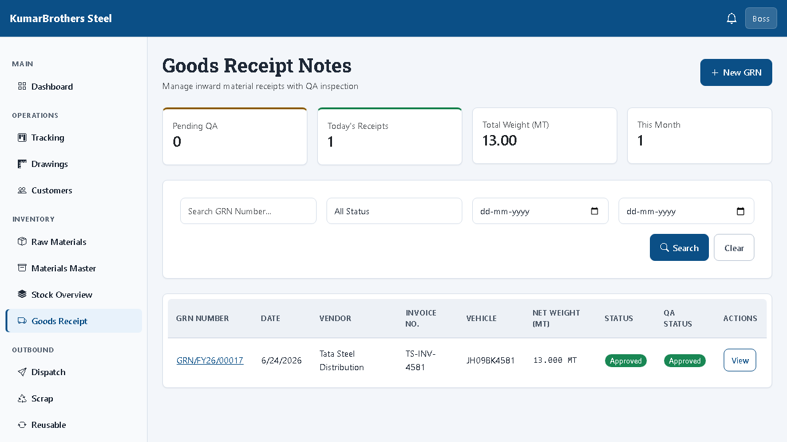

Typical GRN flow:

1. Create vendor if needed.
2. Create draft GRN.
3. Add material line items.
4. Record gross/tare/net weights.
5. Submit for QA.
6. Record QA result for every line.
7. Select the storage yard/rack.
8. Approve GRN to create stock lots.

The GRN detail modal disables risky buttons until their prerequisites are met. Approval is unavailable until the GRN is submitted and every line has a QA decision. Approval processing locks and refreshes the GRN row, so retries after approval do not create duplicate stock lots.

## Dispatch

Dispatch records outward stock movement to customers. Dispatch notes include customer, vehicle, transporter, driver, weighbridge values, and picked stock lots.

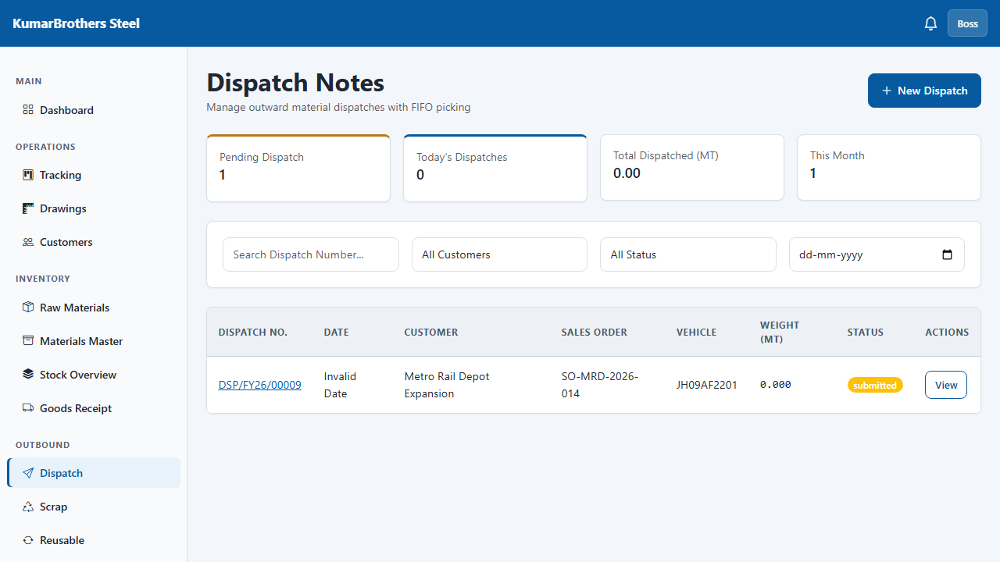

Typical dispatch flow:

1. Create dispatch note for a customer.
2. Add stock-lot line items manually or by FIFO picking.
3. Submit for approval.
4. Confirm dispatch.
5. Stock movement reduces available inventory.

The dispatch detail modal locks pick/remove actions after Draft and locks stock deduction until the dispatch is submitted for approval. Approval processing locks and refreshes the dispatch row, so retries after approval do not deduct stock twice.

## Production Tracking

Production Tracking is the shop-floor board for fabrication, painting, dispatch, and completion. It supports search, customer filtering, pagination, and quantity movement between stages.

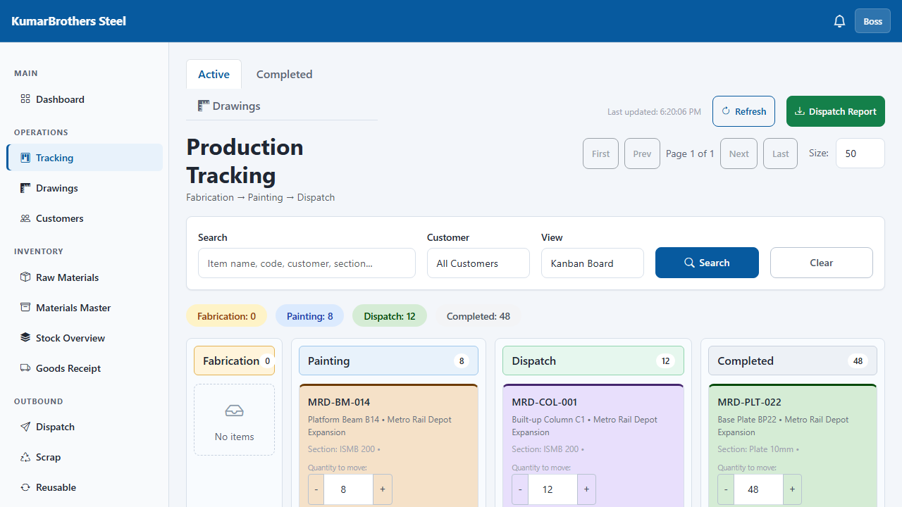

Use this page to move production items through:

- Fabrication
- Painting
- Dispatch
- Completed

The system also shows drawing-based work in the same operations area.
Fabrication completion opens a material-deduction preview first. The stage-advance request is not sent until the operator confirms that modal.

## Drawings And Production

Drawings is the V3 production model. It tracks shop drawings, assemblies, components, component instances, revisions, reservations, and stage transitions.

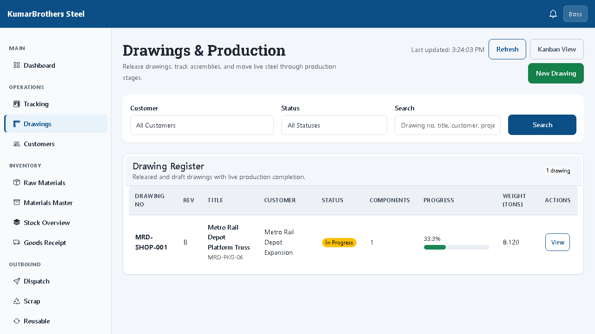

Use this when work must be tracked by engineering drawing rather than only customer/item rows.

Core hierarchy:

```text
Drawing -> Assembly -> Component -> Component Instance -> Stage Transition
```

## Customers

Customers and Projects stores customer project records and links them to production items.

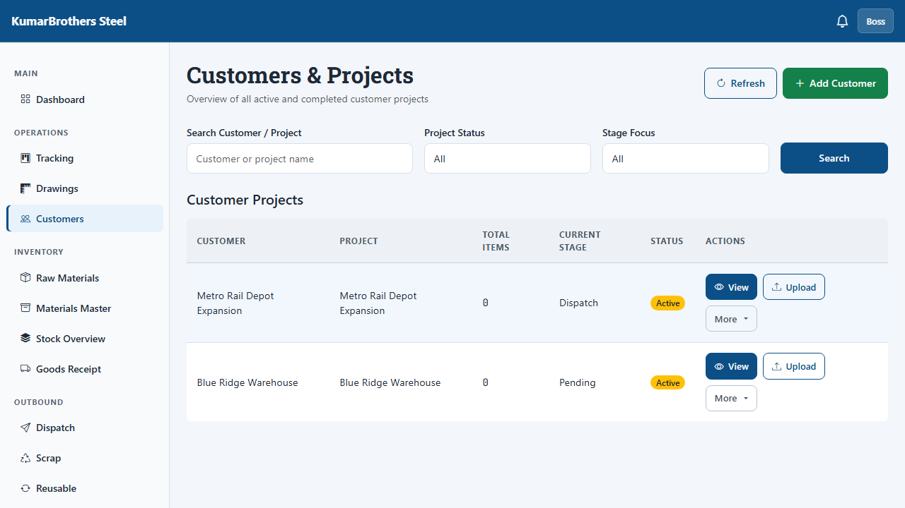

Use it to:

- Create project/customer records.
- Review active projects.
- Navigate into project tracking details.
- Keep customer-facing production work grouped by project.

## Scrap

Scrap records material loss after cutting, defects, damage, overrun, or leftover processing. It feeds loss analytics on the dashboard.

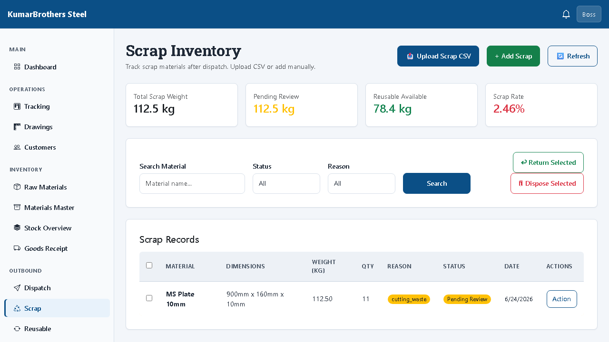

Track:

- Material name and dimensions.
- Weight and quantity.
- Reason code.
- Source customer or production item.
- Disposition status and estimated value.

## Reusable Stock

Reusable Stock tracks offcuts and recovered material that can be used again.

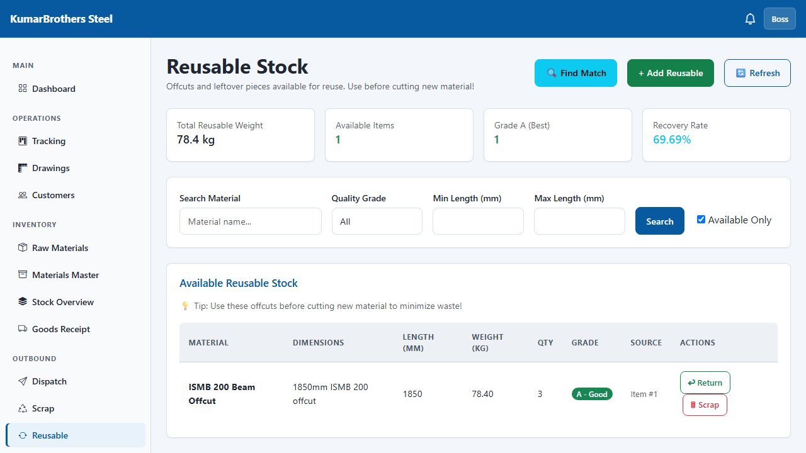

Use it to keep good leftover pieces available for future work instead of treating all offcuts as loss.

## Queries

Queries are user-raised operational questions, usually tied to a customer, production item, or stage. The seeded demo includes a primer thickness clarification.

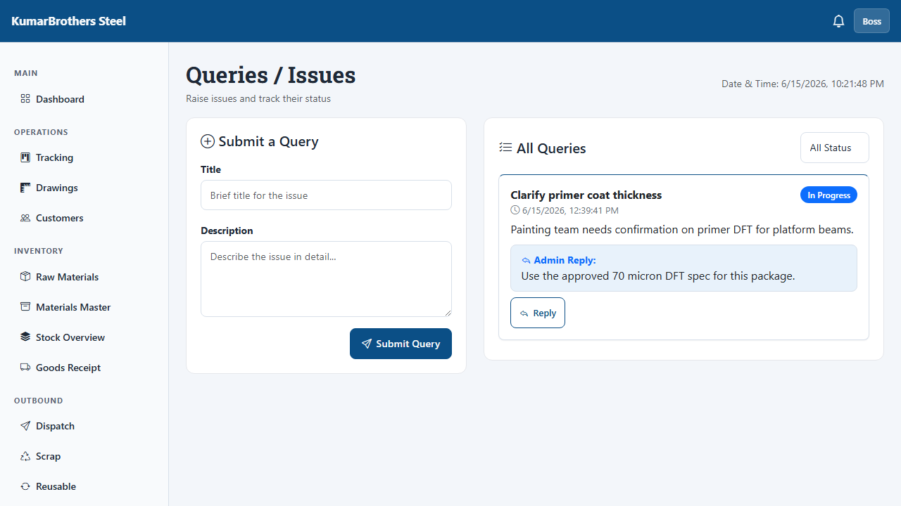

Use it to keep decisions visible instead of leaving clarifications in chat or paper notes.

## Instructions

Instructions are supervisor messages for the team. They appear as operational directives.

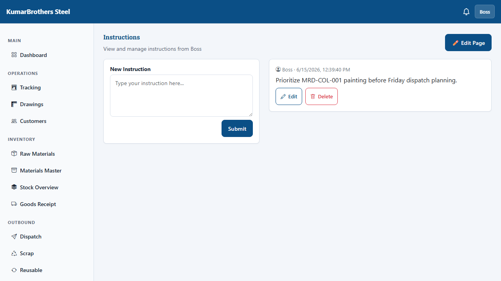

Use it for priority changes, dispatch reminders, or shop-floor instructions.

## Settings

Settings groups account/security, notification preferences, and system settings.

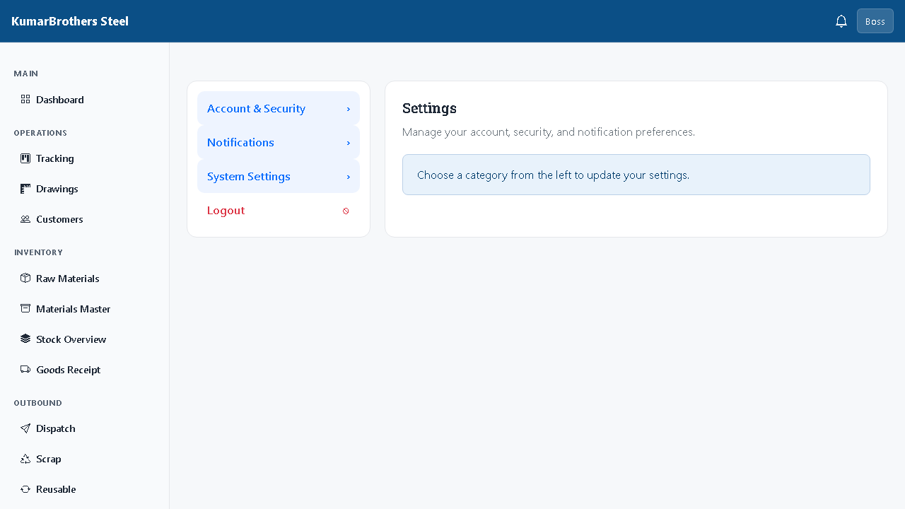

System settings also exist under `/api/v2/settings/*` for company profile, naming series, workflow config, and generic key-value configuration.

## User Admin And Profile

Boss and Software Supervisor roles can create users from the shared authenticated shell. The register page uses the same navigation, role badge, spacing, and control language as the production pages.
The role dropdown is driven by the shared role catalog so Store Keeper, QA Inspector, Dispatch Operator, Fabricator, Painter, Boss, Supervisor, and User stay aligned with backend permissions.

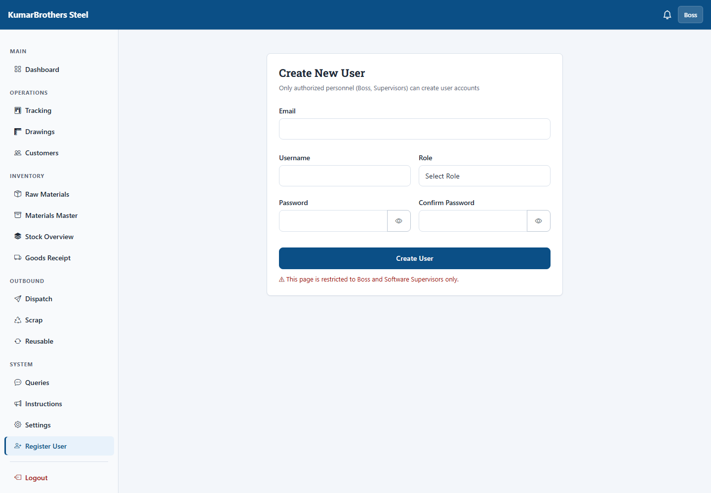

The profile page shows account details and password controls. Password visibility buttons are explicitly named for keyboard and assistive-technology users.

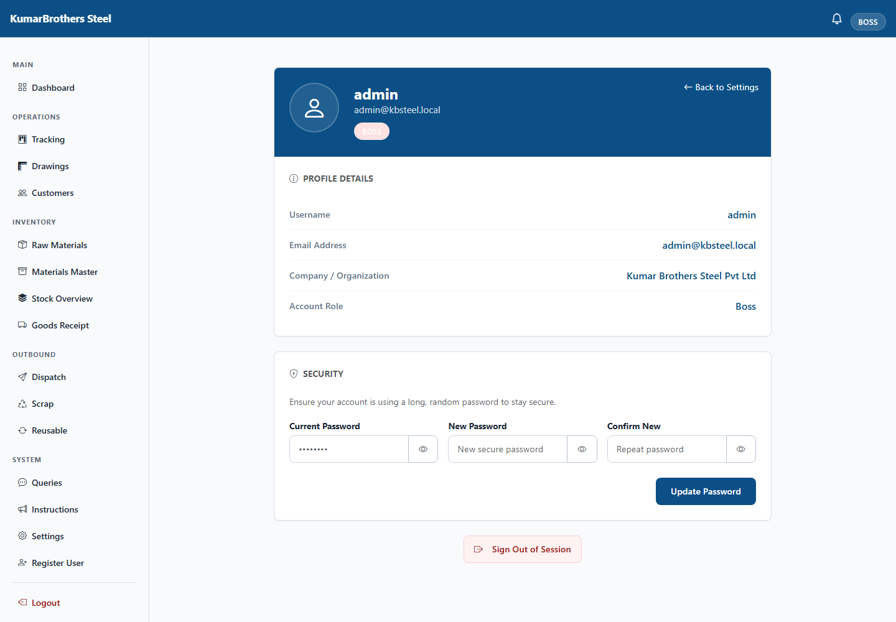

Customer detail pages are covered by the all-page browser QA with real seeded customer IDs, so edit/detail routes are tested the same way an operator reaches them from the customer list.

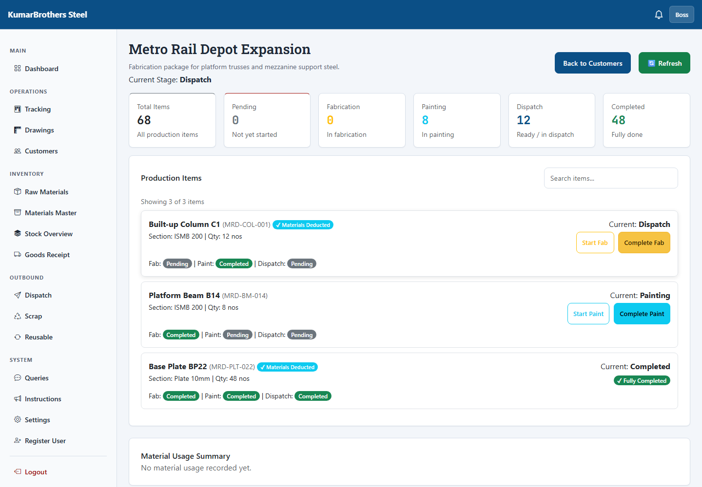

## Roles

The seeded demo creates these local users with the same password, `Boss1234!`: <!-- pragma: allowlist secret -->

- `admin`: Boss
- `boss`: Boss
- `store`: Store Keeper
- `qa`: QA Inspector
- `dispatch`: Dispatch Operator

Important permissions:

- Boss: full access.
- Store Keeper: inventory, GRN create, dispatch create, production consume.
- QA Inspector: QA inspect/approve/reject/hold.
- Dispatch Operator: dispatch create and production view.
- User: read-only operational access.

## API Map

Common API groups:

- `/auth`: login.
- `/users`: current user and profile changes.
- `/inventory`: legacy raw materials and dashboard data.
- `/tracking` and `/api/tracking`: customer/item tracking.
- `/api/v2/inventory`: material master, stock lots, movements.
- `/api/v2/grn`: vendors and goods receipt notes.
- `/api/v2/dispatch`: dispatch notes.
- `/api/v2/reports`: report catalog and report data.
- `/api/v2/print`: printable GRN, dispatch note, delivery challan.
- `/api/v2/settings`: company profile, naming series, workflows, system config.
- `/api/v3/drawings`: drawing-based production.
- `/scrap`: scrap, reusable stock, analytics.
- `/queries`, `/instructions`, `/notifications`: collaboration and alerts.

## Production Notes

Before external production deployment:

- Set `ENVIRONMENT=production`.
- Set a strong `KUMAR_SECRET_KEY`.
- Set `DATABASE_URL` to PostgreSQL.
- Set explicit `CORS_ORIGINS`.
- Run `alembic upgrade head` before app startup. Docker, Railway, Procfile, and `deploy/start.sh` now do this automatically.
- Use `/healthz` for health checks.
- Keep demo credentials out of production.

## QA Commands

Backend:

```powershell
.\.venv\Scripts\python.exe -m ruff check backend_core tests scripts
.\.venv\Scripts\python.exe -m ruff format --check backend_core tests scripts
.\.venv\Scripts\pip-audit.exe -r requirements.txt -r requirements-dev.txt
.\.venv\Scripts\python.exe -m pytest tests -q
cmd /c npm run test:syntax
```

Current verified backend result: `511 passed, 2 skipped`.

Browser:

```powershell
$env:E2E_BASE_URL = "http://127.0.0.1:8000"
$env:E2E_USERNAME = "admin"
$env:E2E_PASSWORD = "Boss1234!" # pragma: allowlist secret
cmd /c npm run test:e2e
```

Current verified browser result: `11 passed`. Playwright now checks every authenticated HTML page plus login for shared shell visibility, page headings, named visible controls, invalid display values, page-level overflow, GRN/dispatch lifecycle state gates, typed raw-material reset confirmation, stock CSV export, customer action permission filtering, password-toggle keyboard state, tablet viewport overflow, and the fabrication material-deduction modal gate.

Design:

```powershell
cmd /c npm run design:impeccable
```

Current full static Impeccable result: passed with zero reported anti-patterns.

Also verified: JavaScript syntax gate (`npm run test:syntax`) passes for the Playwright spec plus shared frontend JavaScript. CI now runs backend lint/format, full pytest, pip-audit, JS syntax, Impeccable, and live Playwright before Docker build.
